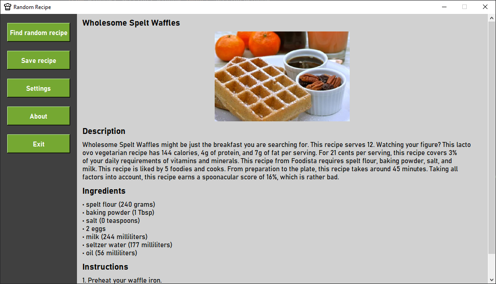
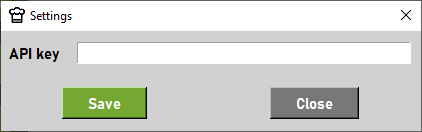

### Random Recipe
The Random Recipe is a simple Tkinter application that allows users to search for random dish recipe and later save it in text format.  
Recipe data is fetched from Spoonacular API.
<p align="center">
    
</p>

### Required Python version
```
>=3.8.0
```

### Setup
1. Clone this repository or download ZIP file:
```
git clone https://github.com/emilian-klein/random-recipe.git
```
2. Go to project directory.
3. Install dependencies:
```
pip install -r requirements.txt
```
4. Run the application:
```
python random_recipe.py
```
5. Add your Spoonacular API key (https://spoonacular.com/food-api) in the settings:
<p align="center">
    
</p>